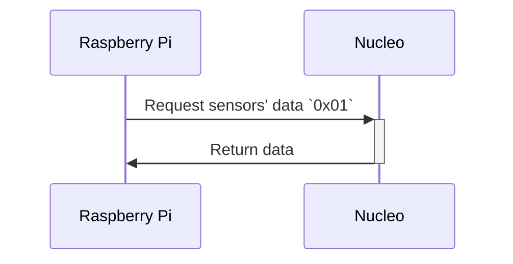
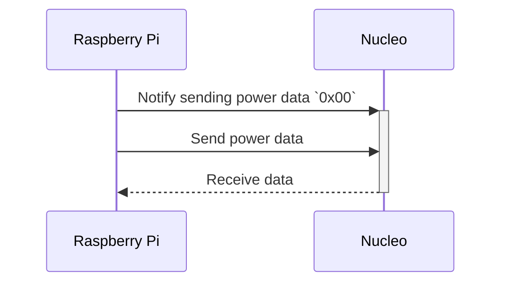
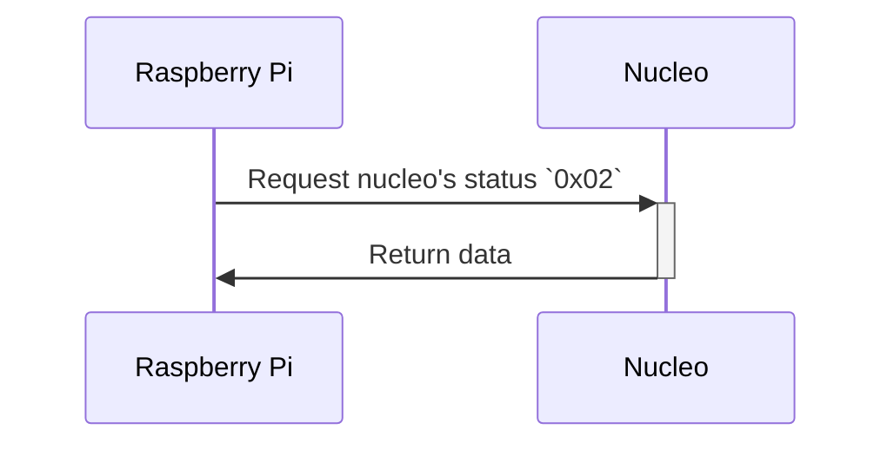
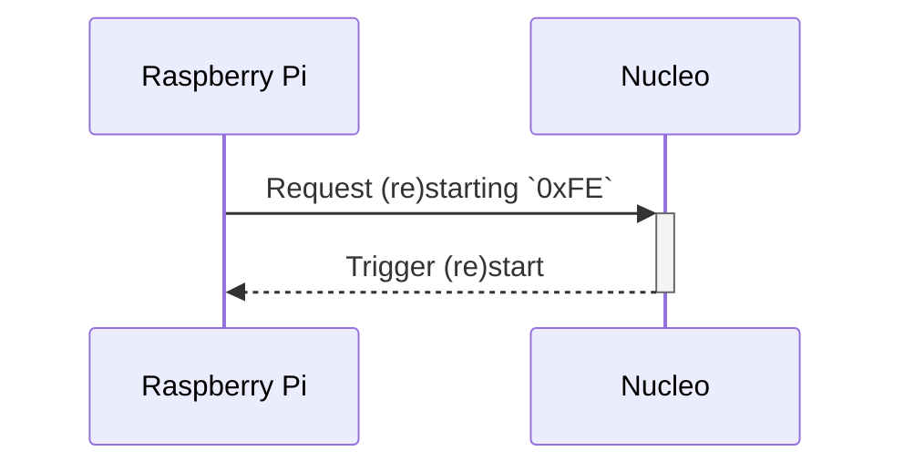
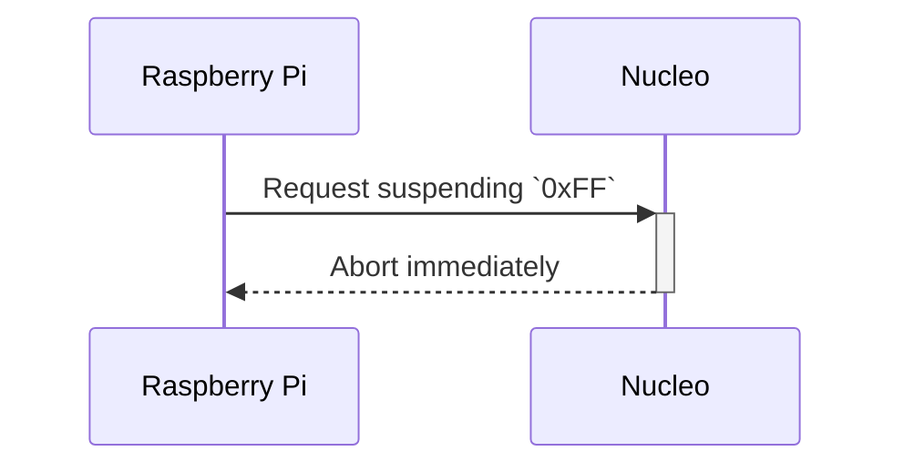
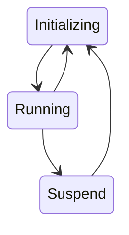

# 2024_umiusi_nucleo

ウミウシの足

## Flow of data

## Data contents

### Nucleo to Raspberry Pi (`0x01`)

 byte index | content
------------|--------
 0 | まげセンサー1の値 LSB
 1 | まげセンサー1の値 MSB
 2 | まげセンサー2の値 LSB
 3 | まげセンサー2の値 MSB
 4 | 電流センサーの値 LSB
 5 | 電流センサーの値 MSB
 6 | 電圧計の値 LSB
 7 | 電圧計の値 MSB

### Raspberry Pi to Nucleo (`0x00`)

 byte index | content
------------|---------------------
 0 | BLDC1のパルス幅[us] LSB
 1 | BLDC1のパルス幅[us] MSB
 2 | BLDC2のパルス幅[us] LSB
 3 | BLDC2のパルス幅[us] MSB
 4 | BLDC3のパルス幅[us] LSB
 5 | BLDC3のパルス幅[us] MSB
 6 | BLDC4のパルス幅[us] LSB
 7 | BLDC4のパルス幅[us] MSB
 8 | Servo1のパルス幅[us] LSB
 9 | Servo1のパルス幅[us] MSB
 10 | Servo2のパルス幅[us] LSB
 11 | Servo2のパルス幅[us] MSB
 12 | Servo3のパルス幅[us] LSB
 13 | Servo3のパルス幅[us] MSB
 14 | Servo4のパルス幅[us] LSB
 15 | Servo4のパルス幅[us] MSB

### Nucleo Status (`0x02`)

 byte index | content
------------|----------------------------------------
 0 | Nucleoの状態 (0: 初期化中, 1: 停止中, 2: 動作中)

## Nucleo Status Flow

