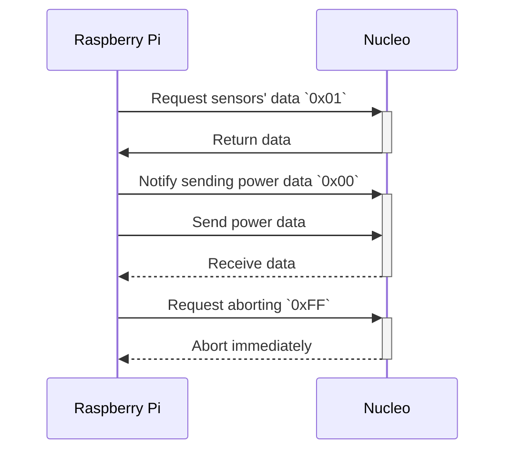

# 2024_cavolinia_nucleo

シロカメガイの足

## Flow of data

## Data contents

### Nucleo to Raspberry Pi

byte index | content
---------- | -------
0 | まげセンサー1の値 LSB
1 | まげセンサー1の値 MSB
2 | まげセンサー2の値 LSB
3 | まげセンサー2の値 MSB
4 | 電流センサーの値 LSB
5 | 電流センサーの値 MSB
6 | 電圧計の値 LSB
7 | 電圧計の値 MSB

### Raspberry Pi to Nucleo

byte index | content
---------- | -------
0 | BLDC1のパルス幅[us] LSB
1 | BLDC1のパルス幅[us] MSB
2 | BLDC2のパルス幅[us] LSB
3 | BLDC2のパルス幅[us] MSB
4 | BLDC3のパルス幅[us] LSB
5 | BLDC3のパルス幅[us] MSB
6 | BLDC4のパルス幅[us] LSB
7 | BLDC4のパルス幅[us] MSB
8 | Servo1のパルス幅[us] LSB
9 | Servo1のパルス幅[us] MSB
10 | Servo2のパルス幅[us] LSB
11 | Servo2のパルス幅[us] MSB
12 | Servo3のパルス幅[us] LSB
13 | Servo3のパルス幅[us] MSB
14 | Servo4のパルス幅[us] LSB
15 | Servo4のパルス幅[us] MSB
